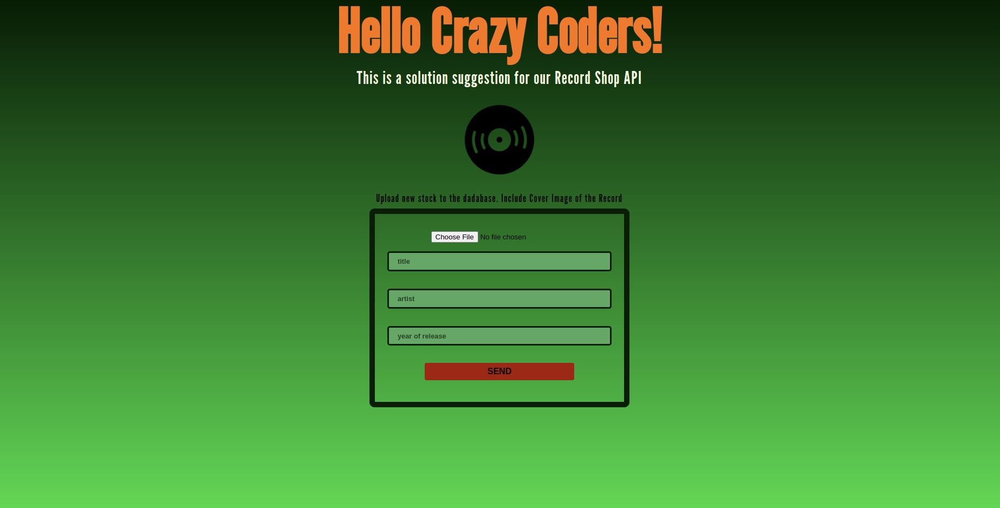

# :dvd: Recordshop :cd:
## Express Mongoose backend project

The recordshop has endpoints for users, orders and records, that our users will use to send different kinds of requests (GET, POST, DELETE, etc).

Only backend. Just the `POST /record` has a form for the file upload with multer in the frontend.

---

### This project includes:

:heavy_check_mark: a seeding script to populate our database with a set of test data [npm package chance](https://www.npmjs.com/package/chance)

:heavy_check_mark: a purge script to delete all documents from our database 

:heavy_check_mark: Error Handling Middleware from Express

:heavy_check_mark: CORS Middleware

:heavy_check_mark: validation / sanitation User [npm package express-validator](https://www.npmjs.com/package/express-validator) 

:heavy_check_mark: password hashing with crypto (built in node module)

:heavy_check_mark: jsonwebtoken [npm package jsonwebtoken](https://www.npmjs.com/package/jsonwebtoken)  

:heavy_check_mark: upload cover images for records with [npm package multer](https://www.npmjs.com/package/multer)  

:heavy_check_mark: User routes are protected. User must authenticate and can only `DELETE and PUT and on /user/:id` after authentication. 
`POST on /user`is open to everyone
`GET on /user` only allowed for admins

**Relationships**

:heavy_check_mark: Recordschema has an embedded Imageschema (it looks cleaner)

:heavy_check_mark: Orderschema has got a reference to the Recordschema

---